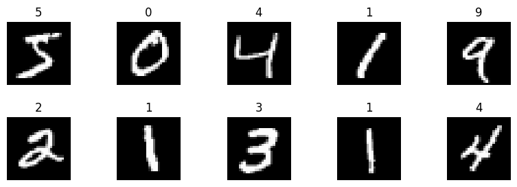
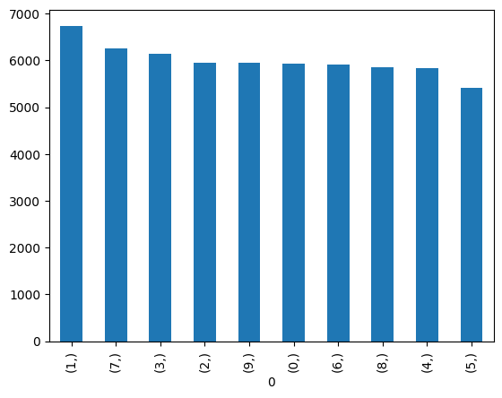
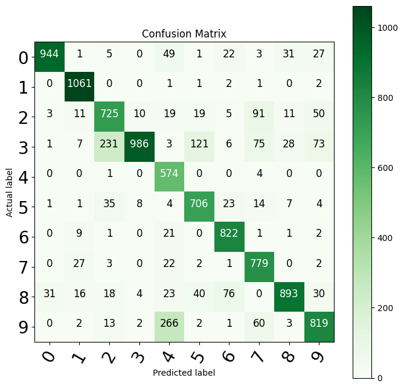

# Federated Learning for MNIST Digit Classification

Author: Sevendi Eldrige Rifki Poluan  
Date: June 2026

## Overview

This project is a simple federated learning pipeline for handwritten digit classification using the MNIST dataset. Instead of collecting all data on a central server, training is distributed across multiple simulated clients. Each client trains locally and only shares model updates with the server.

This setup illustrates the key idea of federated learning: collaborative model training while keeping raw data on local nodes.


## Project Setup

- Dataset: MNIST (28x28 grayscale digit images)
- Number of clients: 7 (simulated)
- Communication rounds: 100
- Frameworks: TensorFlow, NumPy, Pandas, scikit-learn, Matplotlib

## Federated Learning Workflow

1. Load MNIST training and test sets.
2. Split training data across 7 clients.
3. Build one global model and one local model per client.
4. For each round:
	 - Copy global weights to each client model.
	 - Train each client model on local data.
	 - Aggregate updates and apply them to the global model.
5. Evaluate the global model and save the best weights.

## Notebook Visualizations

### Sample MNIST Images



### Label Distribution Across Classes



### Confusion Matrix of the Global Model



## Evaluation Outputs

After training, we compute:

- Accuracy
- Precision (macro)
- Recall (macro)
- F1-score (macro)
- Confusion matrix

These metrics are generated using the test split and scikit-learn utilities.

## Saved Model

Best global model weights are saved to:

- `Saved model/global.model.weights.h5`

## Repository Structure

```
federated_learning_MNIST_digit.ipynb
README.md
Image/
Saved model/
	global.model.weights.h5
```

## References

1. MNIST Dataset (TensorFlow/Keras source used in this notebook): https://www.tensorflow.org/api_docs/python/tf/keras/datasets/mnist/load_data
2. Alternative MNIST dataset page (OpenML): https://www.openml.org/search?type=data&status=active&id=554
3. TensorFlow Documentation. https://www.tensorflow.org/
4. Keras API Documentation. https://keras.io/api/
5. McMahan, B., Moore, E., Ramage, D., Hampson, S., and y Arcas, B. A. (2017). Communication-Efficient Learning of Deep Networks from Decentralized Data. Proceedings of AISTATS. https://arxiv.org/abs/1602.05629
6. scikit-learn Metrics Documentation. https://scikit-learn.org/stable/modules/model_evaluation.html

## Notes

This is an educational implementation intended to explain the federated learning concept. It can be extended with stronger aggregation logic, improved model architecture, and more realistic non-IID client data partitioning.


